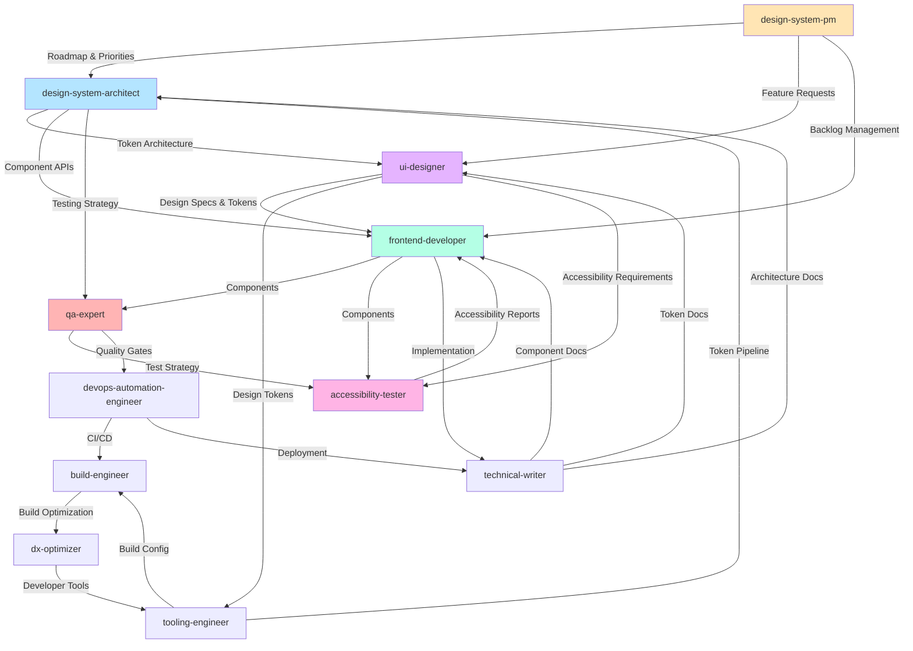

# Análisis del Equipo de Agentes IA - Sando UI Toolkit

**Fecha de análisis:** 2025-10-01
**Proyecto:** Sando Design System
**Total de agentes:** 11

---

## Resumen Ejecutivo

El equipo de agentes IA del proyecto Sando UI Toolkit está compuesto por 11 especialistas que cubren el ciclo de vida completo del desarrollo de un design system: desde arquitectura y diseño hasta implementación, testing, documentación, DevOps y gestión de producto.

### Stack Tecnológico Principal
- **Core:** Lit 3+, TypeScript 5+, Vite, Style Dictionary
- **Testing:** Jest, Playwright, axe-core
- **CI/CD:** GitHub Actions, NPM
- **Documentación:** Storybook
- **Tokens:** Arquitectura de 3 capas (Ingredients/Flavors/Recipes)

---

## Tabla Resumen de Agentes

| **Nombre del Agente** | **Objetivo Principal** | **Herramientas Asignadas** | **Capacidades Clave** |
|----------------------|------------------------|---------------------------|----------------------|
| **accessibility-tester** | Asegurar cumplimiento WCAG 2.1/2.2 para Web Components y validar accesibilidad con tecnologías asistivas | axe, wave, nvda, jaws, voiceover, lighthouse, pa11y, jest | • Validar WCAG 2.1 AA compliance (100%)<br>• Testing con screen readers (NVDA/JAWS/VoiceOver)<br>• Validación de contraste de color (4.5:1 texto, 3:1 UI)<br>• Navegación por teclado completa<br>• Auditoría Shadow DOM accessibility<br>• Integración en CI/CD |
| **build-engineer** | Optimizar rendimiento del sistema de build, reducir tiempos de compilación y mejorar feedback loops | vite, rollup, esbuild, typescript, webpack, turbo, nx, Read/Write/MultiEdit, Bash | • Builds en <30s (producción)<br>• HMR <100ms<br>• Configurar Vite/Webpack/Rollup<br>• Caching distribuido (Turbo/Nx)<br>• Bundle analysis y tree-shaking<br>• TypeScript optimization |
| **design-system-architect** | Establecer arquitectura fundacional: tokens (3 capas), componentes Web, theming y stack tecnológico | Lit, Style Dictionary, Vite, Storybook, Jest, Playwright | • Arquitectura de 3 capas de tokens (Ingredients/Flavors/Recipes)<br>• Framework-agnostic con Web Components<br>• Theming vía HTML attributes<br>• Testing strategy (unit/E2E/a11y)<br>• Configurar Lit + Vite + Storybook |
| **devops-automation-engineer** | Automatizar CI/CD, publicación NPM, deployment de Storybook, seguridad y monitoreo | GitHub Actions, npm, Vercel/Netlify, Snyk, Dependabot, Terraform, Bash | • CI/CD pipelines completos<br>• Automated NPM publishing con semantic versioning<br>• Storybook deployment automation<br>• Security scanning (vulnerabilidades)<br>• DORA metrics tracking<br>• Infrastructure as Code |
| **dx-optimizer** | Optimizar experiencia del desarrollador: build speed, HMR, tests, IDE performance y workflow automation | Vite, Webpack, Turbo, Nx, Rush, Lerna, Bazel | • Build times <30s<br>• HMR <100ms<br>• Test execution <2min<br>• Monorepo optimization<br>• Developer satisfaction >4.0/5<br>• Automation de tareas repetitivas |
| **frontend-developer** | Construir Web Components con Lit + TypeScript: implementar tokens, accesibilidad, tests y Storybook | Lit, TypeScript, Jest, Playwright, @web/test-runner, Storybook | • Implementar componentes Lit con Shadow DOM<br>• Consumir tokens (Recipes layer)<br>• WCAG 2.1 AA compliance<br>• Coverage >85%<br>• Responsive mobile-first<br>• Storybook stories completas |
| **design-system-pm** | Gestión estratégica del producto: roadmap, priorización (RICE), adopción, métricas y stakeholder communication | jira, productboard, amplitude, mixpanel, figma, slack, Read/Write/Bash | • Roadmap planning y OKRs<br>• RICE prioritization framework<br>• Adoption metrics >75%<br>• Developer NPS >40<br>• Developer research y feedback loops<br>• Stakeholder alignment |
| **qa-expert** | Asegurar calidad integral: strategy, unit/E2E/a11y tests, defect management y CI/CD integration | Jest, Playwright, axe-core, jira, testrail, browserstack | • Test coverage >90%<br>• Test automation >70%<br>• WCAG 2.1 AA verification (0 violations)<br>• Cross-browser testing<br>• Visual regression testing<br>• Defect tracking y metrics |
| **technical-writer** | Crear documentación completa: API references, token guides, Storybook docs, developer guides | Storybook, Read/Write/Edit, Mermaid (diagrams), documentation generators | • Component API documentation (100% coverage)<br>• Token architecture docs (3 layers)<br>• Interactive Storybook examples<br>• Developer guides (getting started, contributing)<br>• Migration guides<br>• Readability >60 (Flesch-Kincaid) |
| **tooling-engineer** | Optimizar workflows: build tools, token pipelines, code quality, CI/CD, CLIs y generators | Vite, Style Dictionary, ESLint, Prettier, Husky, GitHub Actions, Read/Write/Bash | • Token transformation <2s (Style Dictionary)<br>• Vite HMR <50ms<br>• ESLint + Prettier automation<br>• Pre-commit hooks<br>• Component generator CLIs<br>• CI/CD optimization |
| **ui-designer** | Diseñar interfaces, establecer tokens (Ingredients/Flavors), componentes, accesibilidad WCAG 2.1 AA y design system | Figma, Figma Tokens plugin, design tools, Mermaid (diagrams) | • Design tokens (Ingredients + Flavors)<br>• Component library design<br>• WCAG 2.1 AA compliance (4.5:1 contrast)<br>• Responsive design (320px-1920px)<br>• Dark mode variants<br>• Developer handoff specs |

---

## Descripción Detallada por Agente

### 1. accessibility-tester

**Rol:** Senior Accessibility Tester
**Modelo:** Sonnet

**Responsabilidades Core:**
- Garantizar cumplimiento WCAG 2.1/2.2 Level AA (100% conformance)
- Testing con tecnologías asistivas (NVDA, JAWS, VoiceOver)
- Validación de navegación por teclado
- Auditoría de Shadow DOM para accesibilidad
- Integración de tests de accesibilidad en CI/CD

**Estándares de Calidad:**
- ✅ WCAG 2.1 Level AA compliance (100%)
- ✅ Zero critical accessibility violations
- ✅ Color contrast ratios: 4.5:1 (texto), 3:1 (UI)
- ✅ Focus indicators: 2px outline, 3:1 contrast
- ✅ Touch targets: ≥44x44px
- ✅ Automated test score >95 (axe-core, Lighthouse)
- ✅ Manual test coverage 100% para interacciones críticas

**Metodología de Testing:**
- **Automated (30%):** axe-core, WAVE, Lighthouse, pa11y
- **Manual Keyboard (30%):** Tab, Shift+Tab, Enter, Space, Arrow keys, Escape
- **Screen Reader (40%):** NVDA (Windows), JAWS (Windows), VoiceOver (macOS/iOS)

---

### 2. build-engineer

**Rol:** Senior Build Engineer
**Modelo:** Sonnet

**Responsabilidades Core:**
- Optimizar tiempos de build (<30s producción)
- Configurar HMR ultra-rápido (<100ms)
- Implementar estrategias de caching (>90% hit rate)
- Bundle analysis y tree-shaking
- Optimización de TypeScript compilation

**Targets de Performance:**
- ✅ Production build time <30s
- ✅ Development server startup <1s
- ✅ HMR update time <100ms
- ✅ Rebuild time <5s (incremental)
- ✅ Bundle size <15KB gzipped por componente
- ✅ Cache hit rate >90% (local + CI)
- ✅ TypeScript compilation <10s

**Herramientas Principales:**
- **Vite:** Dev server ultra-rápido, HMR optimizado
- **Rollup:** Library bundling con tree-shaking
- **esbuild:** JavaScript bundler extremadamente rápido
- **Turbo/Nx:** Monorepo build systems con caching inteligente

---

### 3. design-system-architect

**Rol:** Senior Design System Architect
**Modelo:** Sonnet

**Responsabilidades Core:**
- Definir arquitectura de 3 capas de tokens (Ingredients/Flavors/Recipes)
- Establecer stack tecnológico (Lit, Style Dictionary, Vite)
- Diseñar sistema de theming vía HTML attributes
- Crear componentes framework-agnostic con Web Components
- Establecer testing strategy (unit, E2E, accessibility)

**Arquitectura de Tokens:**

**Layer 1: Ingredients (Primitives)**
- Valores raw: colores, spacing, typography, shadows, radii
- NUNCA referencian otros tokens
- Ejemplo: `color-blue-500: #3b82f6`

**Layer 2: Flavors (Semantic)**
- Tokens con significado contextual
- SOLO referencian Ingredients
- Ejemplo: `color-primary: {color-blue-500}`

**Layer 3: Recipes (Component)**
- Tokens específicos de componentes
- SOLO referencian Flavors
- Ejemplo: `button-padding: {spacing-medium}`

**Estándares de Calidad:**
- ✅ Three-layer token architecture definida claramente
- ✅ Framework agnosticism garantizado
- ✅ Theming funcional vía HTML attributes
- ✅ Testing strategy establecida
- ✅ HMR <500ms
- ✅ Storybook integrado

---

### 4. devops-automation-engineer

**Rol:** Senior DevOps Engineer
**Modelo:** Sonnet

**Responsabilidades Core:**
- Configurar GitHub Actions workflows completos
- Automatizar publicación NPM con semantic versioning
- Deployment automático de Storybook
- Security scanning (npm audit, Snyk)
- Monitoreo y observabilidad

**Estándares de Calidad:**
- ✅ Infrastructure automation 100%
- ✅ Deployment automation 100%
- ✅ Test automation >85% coverage
- ✅ Mean time to production <1 hour
- ✅ Service availability >99.9%
- ✅ Rollback capability <5 minutes

**DORA Metrics Targets:**
- Deployment frequency: >1/day
- Lead time for changes: <1 hour
- Change failure rate: <5%
- Time to restore service: <30 minutes

---

### 5. dx-optimizer

**Rol:** Senior Developer Experience Optimizer
**Modelo:** Sonnet

**Responsabilidades Core:**
- Optimizar build performance
- Mejorar HMR speed
- Reducir test execution time
- Configurar monorepos eficientemente
- Automatizar workflows de desarrollo

**Success Metrics:**
- ✅ Build time <30 seconds
- ✅ HMR <100ms
- ✅ Test suite <2 minutes
- ✅ IDE responsive
- ✅ Developer satisfaction >4.0/5
- ✅ Zero false positives en linting

**Dominios de Optimización:**
- Build optimization (incremental compilation, parallel processing)
- Development server performance (fast startup, instant HMR)
- IDE optimization (indexing speed, code intelligence)
- Testing infrastructure (parallel execution, smart test selection)
- Monorepo excellence (efficient workspaces, task orchestration)

---

### 6. frontend-developer

**Rol:** Senior Frontend Developer
**Modelo:** Sonnet

**Responsabilidades Core:**
- Implementar Web Components con Lit 3+ y TypeScript 5+
- Consumir design tokens (Recipes layer)
- Garantizar WCAG 2.1 AA compliance
- Escribir tests comprehensivos (>85% coverage)
- Crear Storybook stories interactivas

**Estándares de Calidad:**
- ✅ TypeScript strict mode enabled
- ✅ Accessibility WCAG 2.1 AA compliant
- ✅ Responsive mobile-first (320px-1920px)
- ✅ Shadow DOM para encapsulation
- ✅ Performance: Lighthouse >90, FCP <1.8s
- ✅ Test coverage >85%
- ✅ Cross-browser compatible

**Component API Pattern:**
```typescript
@customElement("sando-component")
export class SandoComponent extends LitElement {
  @property({ type: String }) variant: "primary" | "secondary" = "primary";
  @property({ type: Boolean }) disabled = false;
  @property({ attribute: "flavor" }) flavor: "light" | "dark" = "light";
}
```

---

### 7. design-system-pm

**Rol:** Senior Product Manager
**Modelo:** Sonnet

**Responsabilidades Core:**
- Roadmap planning y quarterly OKRs
- Priorización con RICE framework
- Tracking de adoption metrics
- Developer research y feedback loops
- Stakeholder communication

**RICE Prioritization Framework:**
- **Reach:** ¿Cuántos developers impacta?
- **Impact:** ¿Cuánto mejora su workflow?
- **Confidence:** ¿Qué tan seguros estamos?
- **Effort:** ¿Cuánto trabajo requiere?
- **Score:** (Reach × Impact × Confidence) / Effort

**Key Metrics:**
- **North Star:** % of UI development usando design system
- **Business:** 40% faster UI development
- **Product:** 85% adoption rate
- **User:** NPS >55, CSAT >4.3/5
- **Quality:** >90% test coverage, 100% WCAG AA

---

### 8. qa-expert

**Rol:** Senior QA Engineer
**Modelo:** Sonnet

**Responsabilidades Core:**
- Desarrollar test strategy comprehensiva
- Implementar unit/integration/E2E/accessibility tests
- Defect management y tracking
- Quality metrics monitoring
- CI/CD quality gates

**Estándares de Calidad:**
- ✅ Test coverage >90%
- ✅ Test automation >70%
- ✅ Zero critical defects en producción
- ✅ WCAG 2.1 AA verified (0 violations)
- ✅ Cross-browser testing complete
- ✅ Visual regression testing

**Testing Layers:**
1. **Unit Tests (Jest):** Property validation, event emission, slot projection
2. **Integration Tests:** Component composition, parent-child communication
3. **E2E Tests (Playwright):** User flows, cross-browser, keyboard navigation
4. **Accessibility Tests (axe-core):** WCAG compliance, color contrast
5. **Visual Regression:** Theme variants, responsive layouts
6. **Performance Tests:** Render time, bundle size, Lighthouse scores

---

### 9. technical-writer

**Rol:** Senior Technical Writer
**Modelo:** Sonnet

**Responsabilidades Core:**
- Crear component API documentation (100% coverage)
- Documentar token architecture (3 layers)
- Escribir developer guides
- Crear interactive Storybook examples
- Migration guides entre versiones

**Estándares de Calidad:**
- ✅ Readability score >60 (Flesch-Kincaid)
- ✅ Technical accuracy 100%
- ✅ Code examples functional (>95%)
- ✅ API documentation coverage 100%
- ✅ Developer satisfaction >4.2/5
- ✅ Support ticket reduction >50%

**Tipos de Documentación:**
- **Component API Reference:** Props, events, slots, CSS parts, custom properties
- **Token Architecture:** Ingredients, Flavors, Recipes con diagramas
- **Usage Guides:** Getting started, best practices, theming
- **Developer Guides:** Contributing, testing, release workflow

---

### 10. tooling-engineer

**Rol:** Senior Tooling Engineer
**Modelo:** Sonnet

**Responsabilidades Core:**
- Optimizar Vite build configuration
- Implementar Style Dictionary token pipeline
- Configurar ESLint + Prettier automation
- Crear component generator CLIs
- CI/CD pipeline optimization

**Performance Targets:**
- ✅ Token build time <2s
- ✅ Vite dev server startup <1s
- ✅ HMR update time <50ms
- ✅ Production build time <30s
- ✅ TypeScript check <10s
- ✅ CI pipeline total <5min

**Herramientas Clave:**
- **Vite:** Build system ultra-rápido
- **Style Dictionary:** Token transformation pipeline
- **ESLint/Prettier:** Code quality automation
- **Husky:** Pre-commit hooks
- **GitHub Actions:** CI/CD automation

---

### 11. ui-designer

**Rol:** Senior UI/UX Designer
**Modelo:** Sonnet

**Responsabilidades Core:**
- Diseñar interfaces y component libraries
- Definir design tokens (Ingredients + Flavors)
- Garantizar WCAG 2.1 AA compliance
- Crear responsive layouts (mobile-first)
- Dark mode variants

**Estándares de Calidad:**
- ✅ WCAG 2.1 AA: 4.5:1 texto, 3:1 UI
- ✅ Touch targets ≥44x44px
- ✅ Focus indicators: 3:1 contrast
- ✅ Responsive: 320px-1920px
- ✅ Typography: modular scale (1.125, 1.250, 1.333)
- ✅ Spacing: 4px o 8px base unit

**Design Token Layers:**
- **Ingredients (Primitives):** Color scales, typography scales, spacing scales
- **Flavors (Semantic):** Primary, secondary, success, warning, error colors

---

## Mapa de Colaboración entre Agentes



---

## Workflow de Desarrollo Típico

### 1. Planning Phase
**Agentes involucrados:** `design-system-pm`, `design-system-architect`, `ui-designer`

1. PM define roadmap y prioriza con RICE
2. Architect valida feasibility técnica
3. Designer crea specs y tokens

### 2. Design Phase
**Agentes involucrados:** `ui-designer`, `design-system-architect`, `accessibility-tester`

1. Designer crea Ingredients y Flavors tokens
2. Designer diseña componentes en Figma
3. Architect revisa arquitectura de tokens
4. Accessibility-tester valida contraste y specs

### 3. Development Phase
**Agentes involucrados:** `frontend-developer`, `tooling-engineer`, `build-engineer`

1. Tooling-engineer configura pipeline de tokens
2. Frontend-developer implementa componentes Lit
3. Build-engineer optimiza build performance

### 4. Quality Assurance Phase
**Agentes involucrados:** `qa-expert`, `accessibility-tester`, `frontend-developer`

1. QA-expert ejecuta unit/E2E tests
2. Accessibility-tester valida WCAG compliance
3. Frontend-developer corrige issues

### 5. Documentation Phase
**Agentes involucrados:** `technical-writer`, `frontend-developer`, `ui-designer`

1. Technical-writer documenta API y usage
2. Frontend-developer crea Storybook stories
3. Designer provee design rationale

### 6. Deployment Phase
**Agentes involucrados:** `devops-automation-engineer`, `build-engineer`, `design-system-pm`

1. DevOps-engineer ejecuta CI/CD pipeline
2. Build-engineer verifica bundle sizes
3. PM comunica release y cambios

### 7. Optimization Phase
**Agentes involucrados:** `dx-optimizer`, `build-engineer`, `tooling-engineer`

1. DX-optimizer mide developer satisfaction
2. Build-engineer optimiza performance
3. Tooling-engineer mejora developer tools

---

## Métricas Comunes del Equipo

### Performance Metrics
| Métrica | Target | Agente Responsable |
|---------|--------|-------------------|
| Production build time | <30s | build-engineer |
| HMR update time | <100ms | build-engineer, dx-optimizer |
| Token transformation | <2s | tooling-engineer |
| Dev server startup | <1s | build-engineer |
| Test suite execution | <2min | qa-expert, dx-optimizer |
| CI pipeline duration | <5min | devops-automation-engineer |

### Quality Metrics
| Métrica | Target | Agente Responsable |
|---------|--------|-------------------|
| Test coverage | >90% | qa-expert |
| WCAG compliance | 100% AA | accessibility-tester |
| Automated test score | >95 | accessibility-tester |
| Bundle size per component | <15KB gzipped | build-engineer |
| Lighthouse score | >90 | frontend-developer |
| Zero critical defects | 100% | qa-expert |

### Developer Experience Metrics
| Métrica | Target | Agente Responsable |
|---------|--------|-------------------|
| Developer satisfaction | >4.0/5 | dx-optimizer |
| Developer NPS | >40 | design-system-pm |
| Adoption rate | >75% | design-system-pm |
| Documentation satisfaction | >4.2/5 | technical-writer |
| Support ticket reduction | >50% | technical-writer |

### Business Metrics
| Métrica | Target | Agente Responsable |
|---------|--------|-------------------|
| UI development velocity | +40% faster | design-system-pm |
| Design consistency | >95% | design-system-pm |
| Component coverage | >80% patterns | design-system-pm |
| Weekly active developers | >120 | design-system-pm |

---

## Principios Compartidos

### 1. Developer Experience First
Todos los agentes priorizan la experiencia del desarrollador:
- Fast feedback loops
- Clear error messages
- Excellent documentation
- Intuitive APIs

### 2. Accessibility as Baseline
WCAG 2.1 AA es el mínimo, no el objetivo:
- Design with all users in mind
- Test with assistive technologies
- Document accessibility features

### 3. Token-Based Design
Arquitectura de 3 capas consistente:
- **Ingredients:** Primitives (raw values)
- **Flavors:** Semantic tokens
- **Recipes:** Component tokens

### 4. Framework Agnostic
Web Components para máxima compatibilidad:
- Works in React, Vue, Angular, vanilla JS
- No vendor lock-in
- Native browser APIs

### 5. Quality Through Automation
Automatizar testing y quality gates:
- Unit, E2E, accessibility tests
- CI/CD pipelines
- Code quality enforcement

### 6. Data-Driven Decisions
Métricas guían prioridades:
- Performance monitoring
- Developer satisfaction
- Adoption tracking
- Business impact

---

## Recomendaciones de Uso

### Cuándo invocar cada agente

**Inicio de proyecto:**
1. `design-system-architect` - Establecer arquitectura
2. `ui-designer` - Crear tokens base
3. `tooling-engineer` - Configurar pipeline

**Durante desarrollo:**
1. `frontend-developer` - Implementar componentes
2. `qa-expert` - Testing comprehensivo
3. `accessibility-tester` - Validación WCAG

**Pre-release:**
1. `build-engineer` - Optimizar builds
2. `devops-automation-engineer` - Configurar deployment
3. `technical-writer` - Documentar features

**Post-release:**
1. `design-system-pm` - Medir adoption
2. `dx-optimizer` - Mejorar DX
3. `qa-expert` - Regression testing

---

## Recursos y Enlaces

### Archivos de Configuración
- Agentes: `.claude/agents/*.md`
- Vite: `vite.config.ts`
- TypeScript: `tsconfig.json`
- ESLint: `.eslintrc.js`
- Prettier: `.prettierrc`

### Documentación
- Storybook: `/storybook-static`
- API Docs: `/docs/api`
- Token Docs: `/docs/tokens`
- Architecture: `/docs/architecture`

### CI/CD
- GitHub Actions: `.github/workflows`
- NPM Package: `package.json`
- Deployment: Configurado por `devops-automation-engineer`

---

**Última actualización:** 2025-10-01
**Mantenido por:** design-system-pm
**Contribuciones:** Todo el equipo de agentes IA
