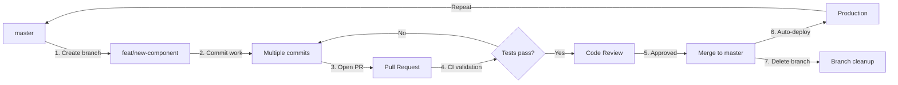

# Git Workflow

**Category**: 03-development
**Version**: 1.1.0
**Status**: Active
**Last Updated**: 2025-11-04
**Owner**: DevOps Automation Engineer

---

## Purpose

Establishes conventional commits, changesets-based versioning, branching strategy, pull request process, and automated release workflow for the Sando Design System monorepo.

---

## Core Rules

### Rule 1: Conventional Commits (Non-Negotiable)

**ALL commits MUST follow the Conventional Commits specification**.

**Pattern**:

```bash
# ✅ CORRECT
git commit -m "feat(components): add sando-button component"
git commit -m "fix(tokens): correct contrast ratios in dark mode"
git commit -m "docs(storybook): update button usage examples"
```

**Anti-pattern**:

```bash
# ❌ WRONG
git commit -m "added button"
git commit -m "fixed bug"
git commit -m "update docs"
```

**Why This Matters**: Conventional commits enable automated changelog generation, semantic versioning, and clear project history. The format is machine-parseable for CI/CD pipelines and changesets integration.

**Reference**: [Conventional Commits Spec](https://www.conventionalcommits.org/)

---

### Rule 2: Changesets for Versioning (Non-Negotiable)

**Every PR with public API changes MUST include a changeset**.

**Pattern**:

```bash
# Create changeset (interactive CLI)
pnpm changeset

# Example changeset file (.changeset/cool-pandas-jump.md):
# ---
# "@sando/components": minor
# ---
#
# Add sando-button component with solid/outline/ghost variants
```

**Anti-pattern**:

```bash
# ❌ WRONG: Manual version bumps in package.json
# Never manually edit version fields - changesets handles this
```

**Why This Matters**: Changesets automate semantic versioning across the monorepo, manage interdependencies between packages, and generate accurate changelogs. Manual versioning creates inconsistencies and breaks automated releases.

**Reference**: [Changesets Documentation](https://github.com/changesets/changesets)

---

### Rule 3: Branch Naming Convention (Non-Negotiable)

**Branch names MUST follow the pattern: `type/description`**

**Pattern**:

```bash
# ✅ CORRECT
git checkout -b feat/button-component
git checkout -b fix/token-contrast-ratios
git checkout -b docs/api-reference
git checkout -b refactor/flavor-mixin
```

**Anti-pattern**:

```bash
# ❌ WRONG
git checkout -b button
git checkout -b fix-bug
git checkout -b my-feature-123
```

**Why This Matters**: Consistent branch naming enables automated CI workflows, improves repository navigation, and provides context at a glance. The pattern mirrors conventional commit types for clarity.

---

### Rule 4: Pull Request Validation (Non-Negotiable)

**All PRs MUST pass CI checks and receive 1+ approval before merge**.

**CI Checks (must pass)**:

- Tests (unit + E2E + a11y)
- Lint (ESLint + Prettier)
- Build (all packages)
- Type checking (TypeScript strict mode)

**PR Title**: Must follow conventional commit format

**Example**:

```
feat(components): add sando-button component

## Summary
- Implements solid, outline, ghost variants
- Supports all standard sizes (sm, md, lg)
- Full WCAG 2.1 AA compliance

## Test Plan
- [x] Unit tests (Vitest)
- [x] E2E tests (Playwright)
- [x] Accessibility tests (axe-core)
```

**Anti-pattern**:

```
# ❌ WRONG: Generic title
Add button

No description or test plan provided.
```

**Why This Matters**: Automated validation catches issues early, reduces manual review burden, and ensures consistent quality. Meaningful descriptions provide context for reviewers and future maintainers.

---

### Rule 5: Release Process (Non-Negotiable)

**Releases MUST follow the 4-step changesets workflow**.

**Pattern**:

```bash
# 1. Create changeset for each PR
pnpm changeset

# 2. Version packages (when ready to release)
pnpm version-packages

# 3. Build all packages
pnpm build

# 4. Publish to NPM
pnpm release
```

**Anti-pattern**:

```bash
# ❌ WRONG: Manual npm publish
npm publish packages/components
# Skips validation, breaks monorepo dependencies, no changelog
```

**Why This Matters**: The changesets workflow ensures semantic versioning, dependency coordination across packages, changelog generation, and atomic releases. Manual publishing breaks these guarantees.

---

## Conventional Commits Standard

### Commit Types

**Complete specification**: [conventionalcommits.org](https://www.conventionalcommits.org/)

| Type       | Usage                      | Scope Examples                | Triggers        |
| ---------- | -------------------------- | ----------------------------- | --------------- |
| `feat`     | New features               | components, tokens, build     | Minor version   |
| `fix`      | Bug fixes                  | accessibility, theming, build | Patch version   |
| `docs`     | Documentation only         | storybook, site, api, readme  | No version bump |
| `refactor` | Code changes (no behavior) | mixin, styles, types          | No version bump |
| `perf`     | Performance improvements   | bundle, render, tokens        | Patch version   |
| `test`     | Test additions/changes     | unit, e2e, a11y               | No version bump |
| `chore`    | Maintenance tasks          | deps, ci, tooling             | No version bump |
| `style`    | Code style/formatting      | prettier, eslint              | No version bump |
| `build`    | Build system changes       | vite, turbo, style-dictionary | Patch version   |
| `ci`       | CI configuration changes   | github-actions, workflows     | No version bump |

### Scopes

**Package-level scopes**:

- `components` - @sando/components
- `tokens` - @sando/tokens
- `docs` - @sando/docs (Storybook)
- `site` - @sando/site (VitePress)

**Feature-level scopes**:

- `button`, `input`, `card` - Specific components
- `theming`, `accessibility`, `build` - Cross-cutting concerns

### Breaking Changes

**Format**: Add `BREAKING CHANGE:` in commit body or `!` after type

```bash
# ✅ CORRECT: Breaking change notation
git commit -m "feat(components)!: remove deprecated size prop

BREAKING CHANGE: The 'size' prop has been removed. Use 'variant' instead.
Migration: Replace size='large' with variant='lg'
"
```

**Triggers**: Major version bump

---

## Changesets Workflow

### When to Create Changesets

**Create changeset when PR changes**:

- Component public API (props, events, slots, CSS parts, methods)
- Token values or structure
- Build output or distribution format
- Peer dependency requirements

**Skip changeset when PR only changes**:

- Documentation (Storybook stories, VitePress guides)
- Internal implementation (no API changes)
- Test files
- Development tooling

### Creating Changesets

```bash
# Interactive CLI
pnpm changeset

# Prompts:
# 1. Select packages to version (space to select, enter to confirm)
# 2. Select bump type (major/minor/patch)
# 3. Enter summary (appears in CHANGELOG.md)
```

**Example changeset** (`.changeset/cool-pandas-jump.md`):

```yaml
---
"@sando/components": minor
"@sando/tokens": patch
---
Add sando-button component

- Implements solid, outline, ghost variants
- Adds button Recipe tokens
- Full keyboard navigation support
```

### Semantic Versioning Rules

| Bump Type | When to Use                                     | Example                                      |
| --------- | ----------------------------------------------- | -------------------------------------------- |
| **major** | Breaking changes (API removal, behavior change) | Remove deprecated prop, change default value |
| **minor** | New features (backward compatible)              | Add new component, add new prop              |
| **patch** | Bug fixes (backward compatible)                 | Fix accessibility issue, correct token value |

**Reference**: [Semantic Versioning](https://semver.org/)

---

## Branching Strategy

### Main Branch

**Branch**: `master` (configured in `.changeset/config.json`)

**Protection**:

- No direct commits (PR required)
- CI checks must pass
- 1+ approval required
- Up-to-date with base branch

### Feature Branches

**Lifecycle**: Create → Work → PR → Merge → Delete

**Types**:

```bash
feat/*      # New features (components, tokens, capabilities)
fix/*       # Bug fixes (accessibility, rendering, tokens)
docs/*      # Documentation (Storybook, VitePress, inline)
refactor/*  # Code improvements (no behavior change)
perf/*      # Performance optimization
test/*      # Test additions (unit, E2E, a11y)
chore/*     # Maintenance (deps, tooling, CI)
```

**Examples**:

```bash
feat/button-component
fix/dark-mode-contrast
docs/theming-guide
refactor/flavor-mixin
perf/bundle-size
test/keyboard-navigation
chore/upgrade-lit-3.3
```

---

## GitHub Flow Principles

### Overview

**Sando Design System follows GitHub Flow** - a lightweight, branch-based workflow designed for frequent deployments and rapid iteration.

**Core Philosophy**:

1. **Master is always deployable** - Every commit to `master` is production-ready
2. **Feature branches are short-lived** - Merge within 3 days to avoid drift
3. **Pull requests are the unit of work** - All changes go through PR review
4. **Deploy frequently** - Continuous deployment from `master`
5. **Delete branches after merge** - Keep repository clean and navigable

**Reference**: [GitHub Flow Guide](https://guides.github.com/introduction/flow/)

### Branch Lifecycle



**Workflow Steps**:

1. **Create branch** from up-to-date `master`
2. **Commit frequently** with conventional commit messages
3. **Open PR early** for feedback and visibility
4. **CI validates** tests, lint, build automatically
5. **Code review** ensures quality (1+ approval required)
6. **Merge to master** triggers automated deployment
7. **Delete branch** automatically after merge

### Short-lived Feature Branches

**Rule**: Feature branches MUST be merged within **3 days** of creation.

**Why This Matters**:

- **Reduces merge conflicts** - Less drift from master
- **Encourages small changes** - Forces atomic, focused PRs
- **Faster feedback loops** - Issues discovered and fixed quickly
- **Continuous integration** - Code integrates early and often

**Pattern** (✅ Good Scope):

```bash
# ✅ Atomic feature - can finish in 2 days
feat/add-button-hover-state

# ✅ Focused bug fix - can finish in 1 day
fix/dropdown-keyboard-nav

# ✅ Small refactor - can finish in 2 days
refactor/extract-focus-mixin
```

**Anti-pattern** (❌ Too Large):

```bash
# ❌ Entire component system - takes 2 weeks
feat/form-system

# ❌ Multiple unrelated changes - takes 1 week
refactor/modernize-codebase

# ❌ Large breaking change - takes 2 weeks
feat/v2-api-redesign
```

**How to Split Large Work**:

1. **Break into phases** - Ship incrementally behind feature flags
2. **Use draft PRs** - Get early feedback on architecture
3. **Create tracking issues** - Coordinate multi-PR features
4. **Merge frequently** - Even incomplete work if not exposed to users

### Always Deployable Master

**Rule**: Every commit to `master` MUST be production-ready.

**Enforcement Mechanisms**:

- **Branch protection** - Direct pushes to `master` blocked
- **Required CI checks** - Tests, lint, build must pass
- **Code review** - 1+ approval required (even for solo developers)
- **Automated deployment** - Successful merge triggers deploy to production

**Pattern** (✅ Deployable):

```bash
# ✅ Complete feature with tests and docs
feat(components): add sando-button with full test coverage

# ✅ Bug fix with regression test
fix(tokens): correct contrast ratio calculation

# ✅ Safe refactor with no API changes
refactor(button): extract focus styles to mixin
```

**Anti-pattern** (❌ Not Deployable):

```bash
# ❌ Incomplete feature (would break user code)
feat(components): add button component (WIP)

# ❌ Failing tests (CI should block this)
fix(tokens): temporary fix, tests failing

# ❌ Broken build (should never reach master)
refactor(build): update config (breaks production build)
```

**Working on Incomplete Features**:

- **Use feature flags** - Disable incomplete work in production
- **Keep code private** - Don't export unfinished components
- **Document status** - Mark as `@experimental` in docs
- **Test in isolation** - Ensure existing features still work

### Branch Auto-delete

**Rule**: Feature branches MUST be deleted immediately after merge.

**Why This Matters**:

- **Reduces clutter** - Keep branch list clean and navigable
- **Signals completion** - Deleted branch = work is merged
- **Prevents confusion** - No stale branches with ambiguous status
- **Encourages fresh starts** - Each new feature starts from current master

**Automation**:

```yaml
# GitHub Settings → Pull Requests
✅ Automatically delete head branches after merge
```

**Manual cleanup** (if needed):

```bash
# Delete local branch after merge
git branch -d feat/button-component

# Delete remote branch (if auto-delete disabled)
git push origin --delete feat/button-component

# Prune stale remote-tracking branches
git fetch --prune
```

**Exception**: Long-lived branches for major versions (e.g., `v1`, `v2`) - these are NOT feature branches and should never be deleted.

### Deployment Workflow

**Trigger**: Every merge to `master` automatically deploys to production.

**Deployment Steps** (automated via GitHub Actions):

1. **Merge PR** - Squash and merge to `master`
2. **CI builds** - Tokens → Components → Storybook → VitePress
3. **Deploy to GitHub Pages** - Automated deployment with health checks
4. **Version PR creation** - Changesets bot creates release PR (if changesets present)

**Rollback Strategy**:

```bash
# Revert specific commit
git revert <commit-sha>
git push origin master

# Creates new commit that undoes changes
# Triggers re-deployment automatically
```

**Why Continuous Deployment Works**:

- **Small changes** - Low risk per deployment
- **Fast feedback** - Issues caught in minutes, not days
- **Easy rollback** - `git revert` undoes problematic changes
- **Automated testing** - CI catches issues before production

---

## Pull Request Guidelines

### PR Title Format

**Must follow conventional commit format**:

```
type(scope): description
```

**Examples**:

```
feat(components): add sando-button component
fix(tokens): correct contrast ratios in dark mode
docs(storybook): update theming examples
```

### PR Description Template

```markdown
## Summary

[Brief description of changes and motivation]

## Changes

- [Bullet point list of specific changes]
- [Component API additions/modifications]
- [Token changes]

## Test Plan

- [ ] Unit tests pass (pnpm test)
- [ ] E2E tests pass (pnpm test:e2e)
- [ ] Accessibility tests pass (axe-core)
- [ ] Manual testing completed
- [ ] Storybook stories added/updated

## Changeset

- [ ] Changeset created (if public API changes)
- [ ] Breaking changes documented (if major bump)

## Screenshots/Videos

[Visual changes if applicable]
```

### CI Validation

**Automated checks** (configured in GitHub Actions):

```yaml
Tests: pnpm test (Vitest unit + Playwright E2E)
Lint: pnpm lint (ESLint + Prettier check)
Build: pnpm build (all packages)
Types: tsc --noEmit (TypeScript strict mode)
```

**Must pass before merge** - no exceptions.

### Review Process

1. **Author**: Create PR with changeset and description
2. **CI**: Automated checks run (tests, lint, build)
3. **Reviewer**: 1+ approval required
4. **Merge**: Squash and merge to master
5. **Cleanup**: Delete feature branch automatically

---

## Release Process

### Step 1: Create Changesets (Per PR)

```bash
# During feature development
pnpm changeset

# Select affected packages
# Choose bump type (major/minor/patch)
# Write summary
```

### Step 2: Version Packages (When Ready)

```bash
# Bump versions and update CHANGELOGs
pnpm version-packages

# This command:
# 1. Reads all changesets in .changeset/
# 2. Bumps package.json versions
# 3. Updates CHANGELOG.md files
# 4. Deletes consumed changesets
# 5. Commits changes
```

### Step 3: Build and Validate

```bash
# Build all packages
pnpm build

# Run tests
pnpm test

# Verify build output
ls packages/components/dist
ls packages/tokens/dist
```

### Step 4: Publish to NPM

```bash
# Publish all changed packages
pnpm release

# This command:
# 1. Builds all packages (pnpm build)
# 2. Publishes to NPM (changeset publish)
# 3. Creates git tags
# 4. Pushes tags to remote
```

### Release Workflow Diagram

```
[Changesets Created] → [version-packages] → [Build] → [Publish]
       (per PR)           (when ready)      (validate)  (to NPM)
         ↓                     ↓                ↓           ↓
    .changeset/           package.json      dist/      npm registry
    cool-pandas.md        version bumped    built      + git tags
```

**Reference**: [Turborepo Publishing Packages](https://turbo.build/repo/docs/handbook/publishing-packages)

---

## Validation Checklist

### Commits

- [ ] Format: `type(scope): description`
- [ ] Type is valid (feat, fix, docs, etc.)
- [ ] Scope matches package or feature
- [ ] Description is clear and imperative mood
- [ ] Breaking changes use `!` or `BREAKING CHANGE:`

### Changesets

- [ ] Created for all public API changes
- [ ] Correct packages selected
- [ ] Appropriate bump type (major/minor/patch)
- [ ] Clear summary explaining changes
- [ ] Breaking changes documented

### Branches

- [ ] Name follows `type/description` pattern
- [ ] Type matches commit type
- [ ] Description is kebab-case
- [ ] Created from up-to-date `master`

### Pull Requests

- [ ] Title follows conventional commit format
- [ ] Description includes summary and test plan
- [ ] All CI checks pass (tests, lint, build, types)
- [ ] 1+ approval received
- [ ] Changeset included (if needed)
- [ ] Conflicts resolved

### Releases

- [ ] All changesets merged to master
- [ ] `pnpm version-packages` run successfully
- [ ] `pnpm build` completes without errors
- [ ] All tests pass
- [ ] `pnpm release` publishes successfully
- [ ] Git tags created and pushed

---

## Related Guidelines

- [MONOREPO_STRUCTURE.md](../02-architecture/MONOREPO_STRUCTURE.md) - Package organization and dependencies
- [CODE_STYLE.md](./CODE_STYLE.md) - TypeScript and formatting standards
- [TESTING_STRATEGY.md](./TESTING_STRATEGY.md) - Test requirements and coverage
- [COMPONENT_ARCHITECTURE.md](../02-architecture/COMPONENT_ARCHITECTURE.md) - Component file structure

---

## External References

- [Conventional Commits](https://www.conventionalcommits.org/) - Commit message specification
- [Changesets](https://github.com/changesets/changesets) - Version management tool
- [Semantic Versioning](https://semver.org/) - Versioning specification
- [Turborepo Publishing](https://turbo.build/repo/docs/handbook/publishing-packages) - Monorepo publishing guide
- [GitHub Flow](https://guides.github.com/introduction/flow/) - Branching workflow

---

## Changelog

### 1.1.0 (2025-11-04)

- **Added GitHub Flow Principles section** (~175 lines)
  - Core philosophy: deployable master, short-lived branches, PR-based workflow
  - Branch lifecycle diagram (Mermaid)
  - Short-lived feature branches rule (<3 days)
  - Always deployable master principle
  - Branch auto-delete requirement
  - Deployment workflow and rollback strategy
- Formalized continuous deployment from master
- Expanded enforcement mechanisms documentation

### 1.0.0 (2025-11-03)

- Initial guideline created
- Conventional commits standard with type/scope/breaking change rules
- Changesets workflow for semantic versioning
- Branch naming convention (`type/description`)
- Pull request validation requirements (CI checks + approval)
- 4-step release process (changeset → version → build → publish)
- Semantic versioning guidelines (major/minor/patch)
- Validation checklists for commits, changesets, PRs, releases
- Agent-optimized format (~400 lines)

---

**Consistent Git workflow enables automated versioning and releases across the monorepo.**
